 

LINGUAGENS &amp; FERRAMENTAS
 

  

 

   

<h3><code>wilkerio@dev ~ $ ./contribuicoes.sh</code></h3>

 

  

   

<h3><code>wilkerio@dev ~ $ whoami --verbose</code></h3>

 

   

📍 Brasil &nbsp;·&nbsp; full-stack + segurança de aplicações

  

